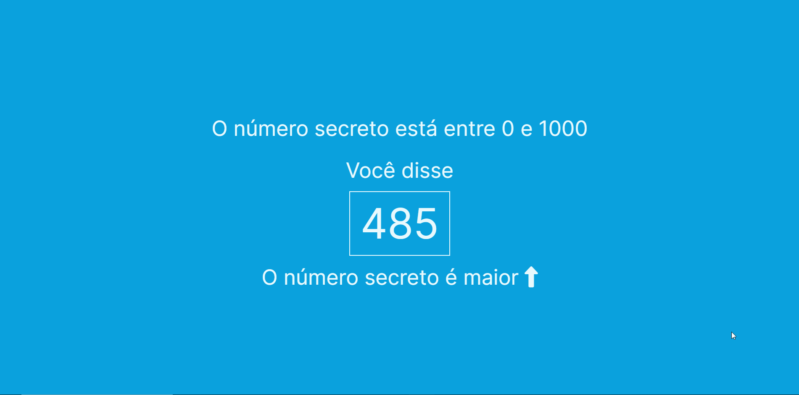

# JogoDoNumero

  <a href="https://jogodonumero.netlify.app/">Acesse o site</a>&nbsp;&nbsp;&nbsp;|&nbsp;&nbsp;&nbsp;
  <a href="#-tecnologias">Tecnologias</a>&nbsp;&nbsp;&nbsp;|&nbsp;&nbsp;&nbsp;
  <a href="#-projeto">Projeto</a>&nbsp;&nbsp;&nbsp;|&nbsp;&nbsp;&nbsp;

 

  

## 🚀 Tecnologias

Esse projeto foi desenvolvido com as seguintes tecnologias:

- HTML
- CSS
- JAVASCRIPT
- WEB SPEACH API

## 💻 Projeto

Este projeto é um jogo de adivinhação de número via reconhecimento de voz.
